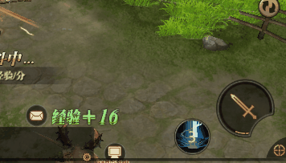
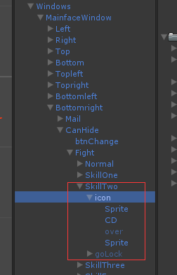
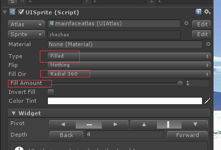

#UI实例

##技能冷却按钮

示例：

技能按钮组成：

技能按钮冷却遮罩动画实现：

1. 设置Sprite或Image的type为Fill;
2. 设置Fill Dir, 各种填充的方式
3. Fill amount， 0-1， 在Update方法改变value

code:

    protected override void OnUpdate()
    {
        if (!this.World.Ref.CanFight)
        {
            if (cdText)
            {
                cdText.text = string.Empty;
            }
            if (mask)
                mask.fillAmount = 1;
            return;
        }

        if (IsCooling())
        {
            if (cdText)
            {
                cdText.text = (Remain / 1000 + 1).ToString(); //冷却CD 刷新
            }
            if (mask)
                mask.fillAmount = (float)Remain / 1000 / cs.reference.Cd; //遮罩刷新
        }
        else
        {
            if (cdText)
            {
                cdText.text = string.Empty;
            }

            if (mask)
            {
                // 不是战士，或者不是战士的八连斩，直接mask不显示
                // 如果是战士的八连斩 mask 跟据Fp只处理
                if (this.Mp.RoleOcc != RoleOccupation.Warrior || !cs.IsFinalAttack )
                    mask.fillAmount = 0;
            }
            
            if (cs.HasSS())
                cs.CheckTimeOut();
        }
    }